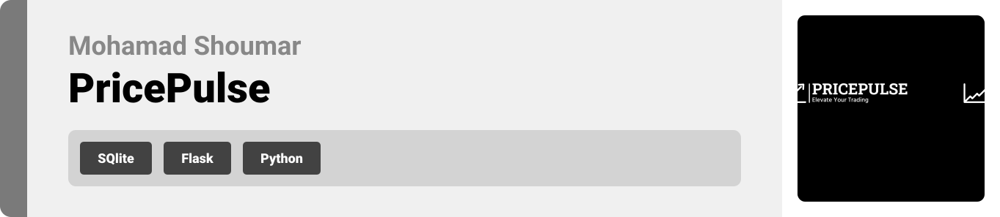
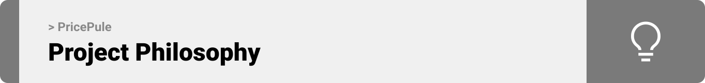
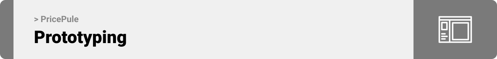
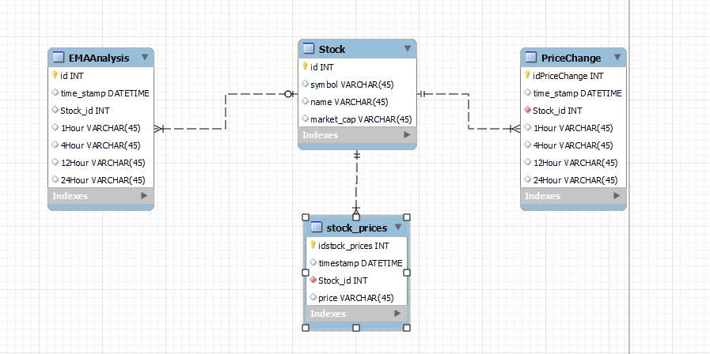
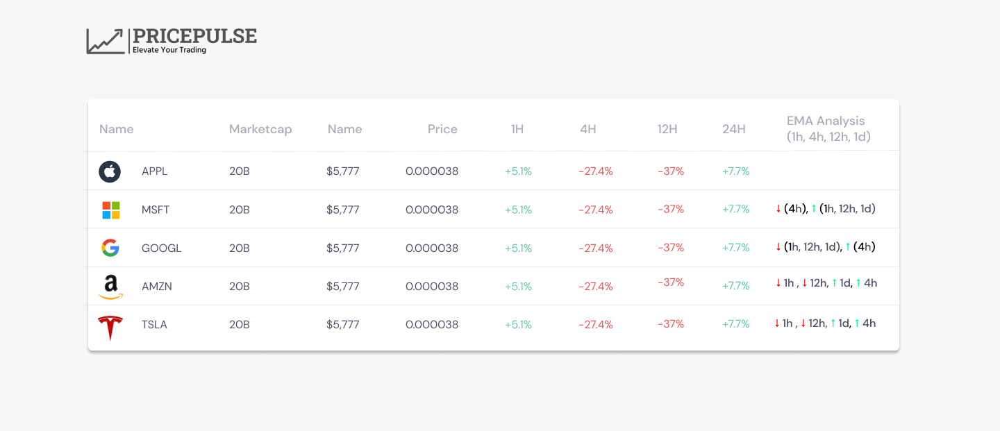
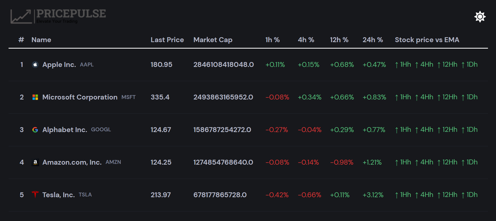
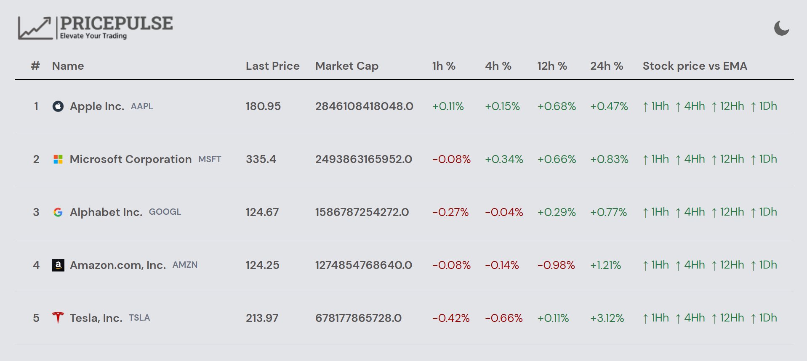
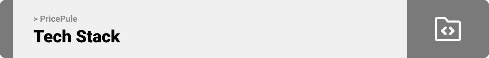

<br><br>

<!-- project philosophy -->


> The PricePulse web app provides users with stock price information, EMA analysis, and price change percentages for the top 5 stocks in the NASDAQ index.
>
> The intuitive user interface and seamless user experience make it easy for users to stay informed about the market trends.

### User Stories

- As a user, I want to view the current stock prices for the top 5 stocks with the highest market capitalization in the NASDAQ index, so that I can stay updated on the latest market trends.
- As a user, I want to easily identify if a stock is trading above or below the 200 EMA (exponential moving average) on different timeframes, so that I can make informed decisions based on technical analysis.
- As a user, I want to see the price change percentage for each stock over different timeframes (1 hour, 4 hours, 12 hours, and 1 day), so that I can quickly assess their performance.

<br><br>

<!-- Prototyping -->


> We designed PricePulse using wireframes and mockups, iterating on the design until we reached the ideal layout for easy navigation and a seamless user experience.

### ER daigram and Mockup

> |     | ER Diagram                     | Mockup                            |
> | --- | ------------------------------ | --------------------------------- |
> |     |  |  |

### Implementation

> |     | Dark Mode                            | Light Mode                            |
> | --- | ------------------------------------ | ------------------------------------- |
> |     |  |  |


### PricePulse is built using the following technologies:

-Flask: A Python web framework used for backend development.

-SQLite: A lightweight and portable database management system suitable for small to meduim projects

-CSS: Used for styling and enhancing the user interface.

<!-- How to run -->


> To set up PricePulse locally, follow these steps:

### Prerequisites

Python 3.7 or above
Flask library
SQLite database

This is an example of how to list things you need to use the software and how to install them.

- npm
  ```sh
  npm install npm@latest -g
  ```

### Installation

_Below is an example of how you can instruct your audience on installing and setting up your app. This template doesn't rely on any external dependencies or services._

1. Clone the repo
   ```sh
   git clone https://github.com/mohamad-shoumar/Stock-Dashboard-CoinQaunt-Challenge
   ```
   Here you will find three folders (frontend, backend, and the database)
2. Navigate to the directory:

   ```sh
   cd Stock-Dashboard-CoinQaunt-Challenge
   ```

3. Install the required dependecies, run:
   ```sh
   pip install -r requirements.txt
   ```
4. Run the app:
   ```sh
   python app.py
   ```
5. Open your web browser and navigate to http://localhost:5000 to access PricePulse.
